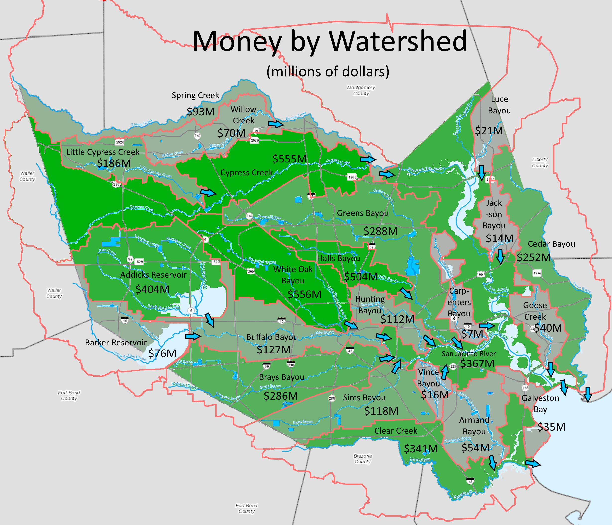

# 2018 HCFCD Bond

## Background

In 2018, Harris County voters approved a bond for flood control measures. I wrote this analysis before the election.

[See program details from Harris County Flood Control District here](https://www.hcfcd.org/bond-program/).

## Purpose

Where is the money being spent? Is the distribution of funds equitable? Will it effectively reduce future costs?

## Money by Watershed

The bonds will raise $2.5 billion to be repaid by Harris County property tax. Many projects are in partnership with federal agencies, which will cover around 75% of a given project's cost. With bond and federal money together, the total money for projects is $5,512,455,000. Here that money is broken down by watershed. Not shown is $921 million for "countywide" projects.

## Money per Harvey-Damaged Structure by Watershed

According to HCFCD, 154,180 structures were damaged by Harvey. If flooding were strictly a local issue, I would expect the money per damaged structure to be roughly equal for all watersheds. But flooding is a regional issue: every watershed drains into one neighboring watershed. All water flows towards Galveston Bay.

An excess of funding is going to watersheds at the edges of Harris County, particularly in the Northwest. I think this makes sense: deal with water flowing from neighboring counties by building infrastructure in the least-developed parts of Harris County. Though we may be a little over-invested in Cypress and Spring.

## Already over budget?

There are 2 kinds of projects on HCFCD's list: those which are "Local Only" and those with a "Partner Share" and "Local Match". By my best understanding, the total money spent by Harris County is the sum of all "Local Only" and "Local Match" figures, which comes to $3,123,193,750. That means the projects will already be 25% over budget if the $2.5 billion bond measure passes. Looks like HCFCD will have to cut many projects to balance the books, and we can only guess which ones.

## Final Thoughts

It's hard to imagine any initiative related to flood control being voted down. I think the spending pattern in the project list makes sense overall. Time will tell if these are the right measures to protect Harris County from the kind of terrible flood damage we've seen for the past 3 years.
